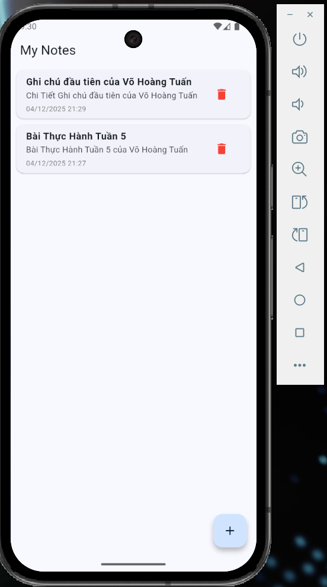

# 📝 Simple Note App (Week 5) – của Võ Hoàng Tuấn

## ✨ Tính năng chính

1.  **Quản lý Ghi chú (CRUD):**
    - **Tạo mới:** Thêm ghi chú với tiêu đề và nội dung.
    - **Xem danh sách:** Hiển thị danh sách ghi chú có thể cuộn, sắp xếp theo thời gian cập nhật.
    - **Chỉnh sửa:** Cập nhật nội dung ghi chú đã có.
    - **Xóa:** Xóa ghi chú không còn cần thiết.
2.  **Lưu trữ Offline:**
    - Sử dụng **SQLite** để lưu trữ bền vững (Persistent local storage). Dữ liệu không bị mất khi tắt app.
3.  **Theo dõi thời gian:**
    - Tự động lưu thời gian tạo và thời gian cập nhật lần cuối cho mỗi ghi chú.

## 🛠️ Công nghệ sử dụng

- **Ngôn ngữ:** Dart, Flutter.
- **State Management:** `provider` (^6.1.0).
- **Database:** `sqflite` (^2.3.0).
- **Utilities:** `intl` (định dạng ngày tháng), `path_provider`.

## 📸 Ảnh chụp màn hình

Dưới đây là giao diện thực tế của ứng dụng:

|        Màn hình Chính (Danh sách)         |                                          Màn hình Soạn thảo                                          |
| :---------------------------------------: | :--------------------------------------------------------------------------------------------------: |
|  |   |

## 📂 Cấu trúc thư mục

```text
lib/
├── database/              # Xử lý kết nối DB (DatabaseHelper - Singleton)
├── models/                # Định nghĩa dữ liệu (Note Model)
├── providers/             # Quản lý trạng thái (NoteProvider - ViewModel)
├── screens/               # Giao diện người dùng (HomePage, NoteEditor)
├── widgets/               # Các widget tái sử dụng (NoteCard)
└── main.dart              # Khởi chạy ứng dụng và cấu hình Provider
```
