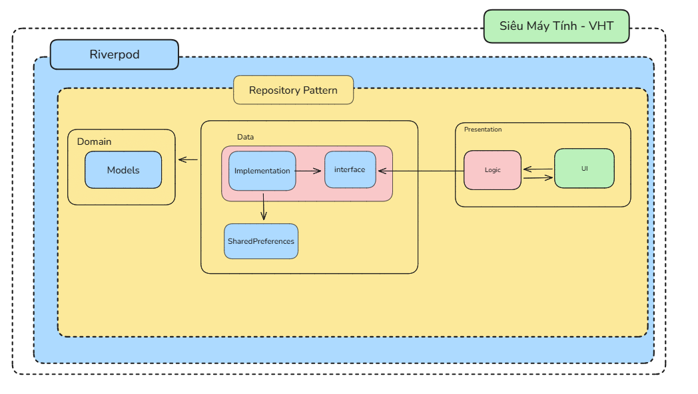
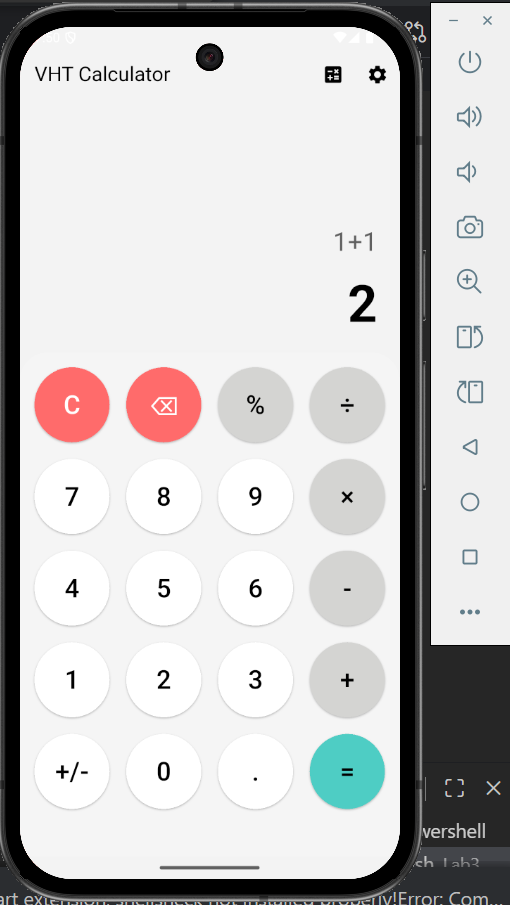
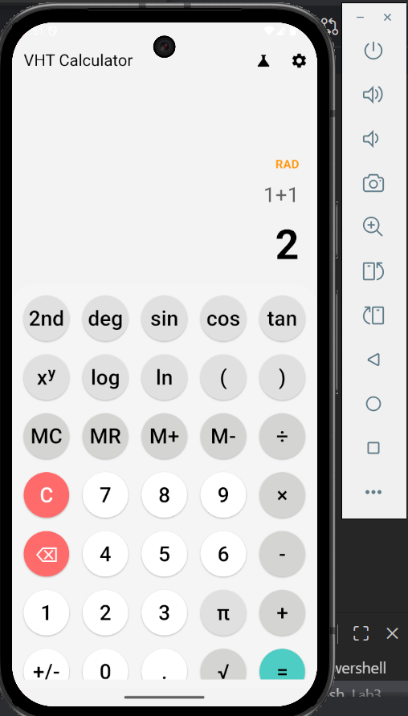
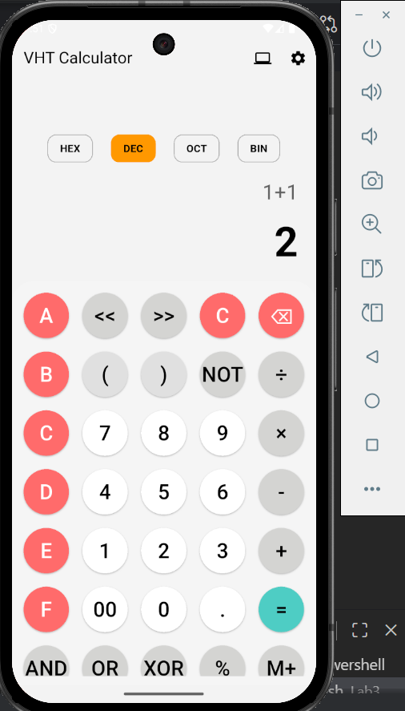

# 📱 SIÊU MÁY TÍNH Lab3 – của Võ Hoàng Tuấn


## 📝 Giới thiệu
Đây là ứng dụng máy tính đa năng được viết bằng **Flutter**, hỗ trợ 3 chế độ: Cơ bản, Khoa học và Lập trình viên. Dự án áp dụng **Clean Architecture** và **Riverpod** để quản lý trạng thái, đảm bảo code sạch và dễ mở rộng.

## 🏗️ Kiến trúc Dự án
Dự án sử dụng mô hình Layered Architecture (Tầng Presentation, Logic, Data) kết hợp với Repository Pattern. Vì đây là máy tính không có nghiệp vụ nên tầng Domain ta sẽ không có định nghĩa


*(Sơ đồ luồng dữ liệu giữa UI, Riverpod và Repository)*

## ✨ Tính năng chính

1.  **Đa chế độ:**
    * **Cơ bản:** Phép tính (+, -, ×, ÷).
    * **Khoa học:** Lượng giác (sin, cos...), Logarit, Căn bậc 2, Số mũ.
    * **Lập trình viên:** Chuyển đổi HEX/DEC/BIN và phép toán Bitwise.
2.  **Giao diện:** Dark/Light Theme (Lưu cài đặt tự động).
3.  **Lưu trữ:** Lịch sử tính toán được lưu lại ngay cả khi tắt app.

## 📸 Ảnh chụp màn hình

Dưới đây là giao diện thực tế của ứng dụng:

| Chế độ Cơ bản | Chế độ Khoa học & Theme | Chế độ Lập trình viên |
|:---:|:---:|:---:|
|  |  |  |

## 📂 Cấu trúc thư mục

```text
lib/
├── data/                  # Xử lý dữ liệu (Repository)
├── presentation/          # Giao diện và Logic (UI, Providers)
├── utils/                 # Các hàm toán học (CalculatorLogic)
└── main.dart              # Khởi chạy ứng dụng
