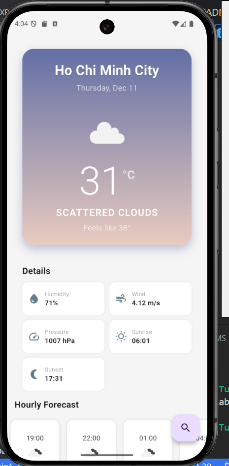
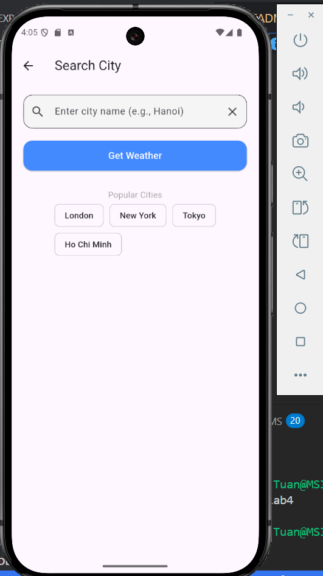
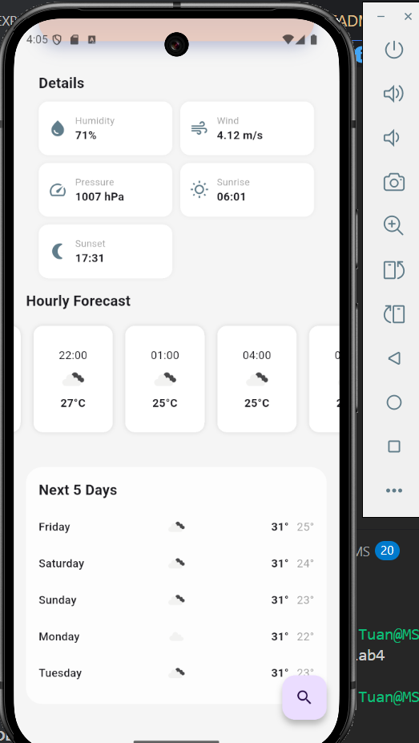

# 🌤️ Flutter Weather App

Link video: [https://drive.google.com/file/d/1l33whX0EbBiwIBRqWs-txwg85jaMAQ9h/view?usp=sharing](https://drive.google.com/file/d/1ffiGyKUYIlslgw2PMp25F5JFEKsPWnav/view?usp=sharing)


---

## 📸 Hình ảnh minh họa (Screenshots)

|                                               |                                               |                                               |                                               |
| :-------------------------------------------: | :-------------------------------------------: | :-------------------------------------------: | :-------------------------------------------: |
|  |  |  |  |

---


## 🛠️ Cài đặt & Hướng dẫn chạy (Installation)

### 1. Yêu cầu (Prerequisites)

- [Flutter SDK](https://flutter.dev/docs/get-started/install) (phiên bản ổn định mới nhất)
- Tài khoản [OpenWeatherMap](https://openweathermap.org/) để lấy API Key (miễn phí).

### 2. Thiết lập môi trường (Environment Setup)

Vì lý do bảo mật, API Key không được lưu trực tiếp trên GitHub. Cần thiết lập file môi trường:

1.  Tạo file tên là `.env` tại thư mục gốc của dự án (cùng cấp với `pubspec.yaml`).
2.  Copy nội dung từ file `.env.example` sang `.env`.
3.  Thay thế nội dung bằng API Key của bạn:

```env
API_WEATHER_KEY=dien_api_key_cua_ban_vao_day
```
